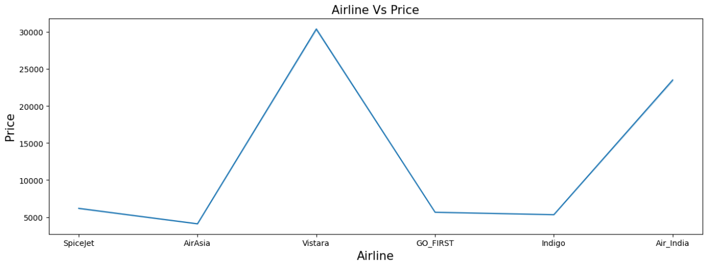
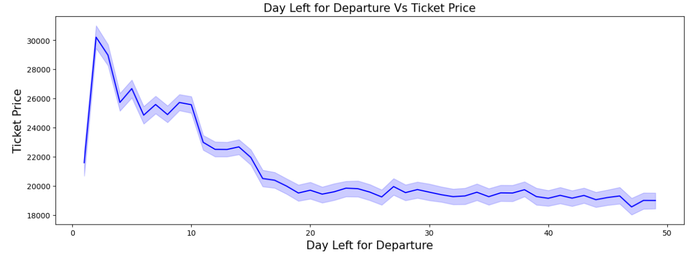
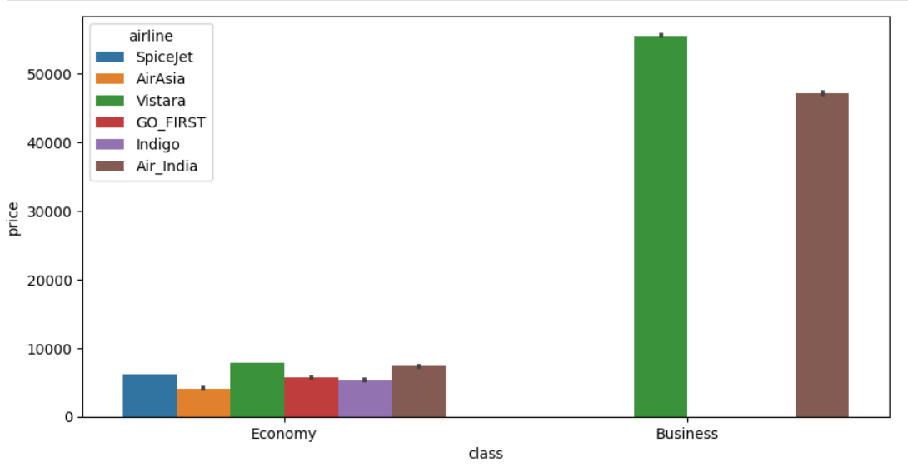
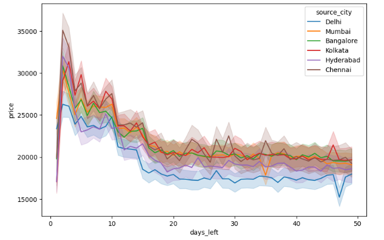
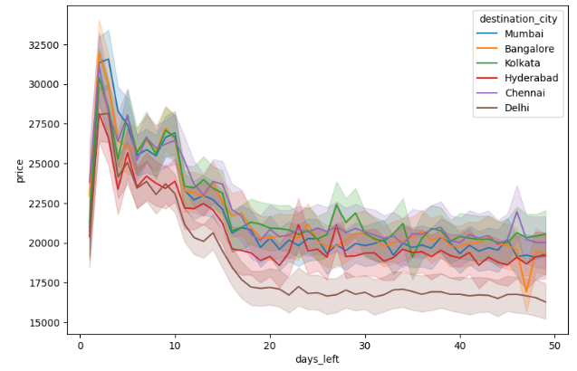
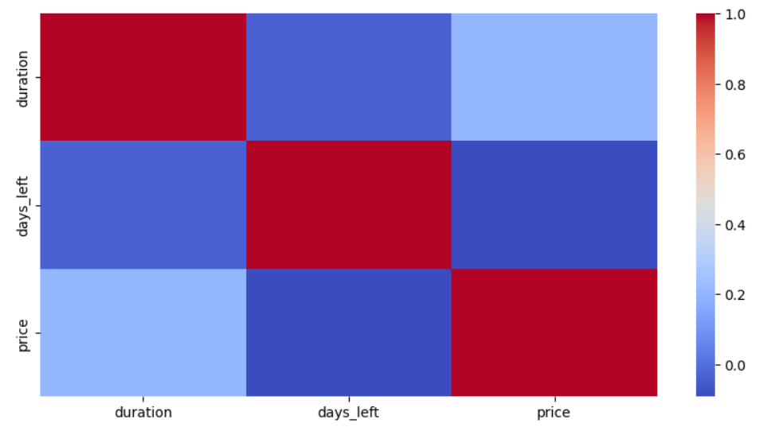
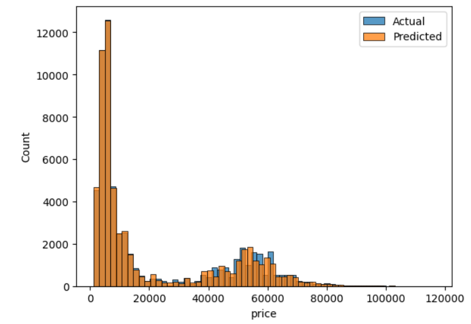

# ✈️ Flight Booking Price Prediction using Machine Learning

A machine learning project that predicts airline ticket prices based on various flight attributes such as airline, source city, destination city, travel class, departure time, arrival time, duration, number of stops, and days remaining before departure.

The project performs comprehensive Exploratory Data Analysis (EDA), data preprocessing, feature engineering, model training, and evaluation to understand the key factors influencing flight ticket prices and build an effective prediction model.

---

## 📖 Project Overview

Flight ticket prices fluctuate due to multiple factors, including airline, travel class, booking time, route, and flight duration. Accurate prediction of airfare can help travelers make informed booking decisions and assist businesses in understanding pricing patterns.

This project explores these factors using data analysis and machine learning techniques to predict ticket prices from historical flight booking data.

---

## 📂 Dataset

The dataset contains information about domestic flight bookings with the following features:

| Feature | Description |
|----------|-------------|
| Airline | Airline company |
| Flight | Flight code |
| Source City | Departure city |
| Departure Time | Time of departure |
| Stops | Number of stops |
| Arrival Time | Time of arrival |
| Destination City | Destination city |
| Class | Economy or Business |
| Duration | Flight duration |
| Days Left | Number of days before departure |
| Price | Flight ticket price (Target Variable) |

---

## 🛠️ Technologies Used

- Python
- Jupyter Notebook
- NumPy
- Pandas
- Matplotlib
- Seaborn
- Scikit-learn

---

## 📊 Exploratory Data Analysis

Several visualizations were created to better understand the relationships between different flight attributes and ticket prices.

### Average Ticket Price by Airline



**Observation**

- Vistara and Air India have the highest average ticket prices.
- AirAsia generally offers the lowest average fares.
- Airline choice has a significant impact on ticket pricing.

---

### Ticket Price vs Days Left Before Departure



**Observation**

- Ticket prices are generally higher when bookings are made closer to the departure date.
- Booking flights well in advance often results in lower ticket prices.

---

### Ticket Price by Travel Class



**Observation**

- Business class fares are significantly more expensive than Economy class.
- Vistara and Air India dominate the Business class segment with the highest ticket prices.

---

### Source City vs Ticket Price



**Observation**

- Ticket prices vary across departure cities.
- Some cities consistently exhibit higher average fares depending on the booking window.

---

### Destination City vs Ticket Price



**Observation**

- Destination city also influences ticket prices.
- Different routes display distinct pricing trends throughout the booking period.

---

### Correlation Analysis



The correlation heatmap illustrates the relationships among numerical features in the dataset.

Key observations include:

- Flight duration has a positive correlation with ticket price.
- Days left before departure shows a slight negative relationship with price.
- Numerical features contribute differently toward ticket price prediction.

---

## ⚙️ Data Preprocessing

The following preprocessing steps were performed before training the machine learning model:

- Dataset inspection
- Missing value verification
- Duplicate record checking
- Feature selection
- Categorical feature encoding
- Train-Test split
- Feature preparation for machine learning

---

## 🤖 Machine Learning Workflow

The project follows a standard supervised machine learning pipeline:

1. Load the dataset
2. Perform exploratory data analysis
3. Clean and preprocess the data
4. Encode categorical variables
5. Split the dataset into training and testing sets
6. Train the regression model
7. Predict flight ticket prices
8. Evaluate model performance
9. Compare actual and predicted price distributions

---

## 📈 Model Evaluation

The regression model was evaluated using standard performance metrics, including:

- Mean Absolute Error (MAE)
- Mean Squared Error (MSE)
- Root Mean Squared Error (RMSE)
- R² Score

### Actual vs Predicted Ticket Price Distribution



The predicted ticket price distribution closely follows the actual distribution, indicating that the model successfully captures the overall pricing patterns in the dataset.

---

## 📋 Requirements

Install the required Python libraries before running the notebook.

```bash
pip install numpy pandas matplotlib seaborn scikit-learn jupyter
```

---

## 🚀 Running the Project

1. Clone the repository.

```bash
git clone https://github.com/Swaroop-Haridas/Flight_Booking_Price_Prediction.git
```

2. Open the project directory.

3. Launch Jupyter Notebook.

```bash
jupyter notebook
```

4. Open:

```
FlightBookingPricePrediction.ipynb
```

5. Run the notebook cells sequentially to reproduce the analysis and model predictions.

---

## 💡 Key Insights

- Airline selection significantly affects ticket prices.
- Business class tickets are substantially more expensive than Economy class.
- Booking flights earlier generally results in lower fares.
- Flight duration contributes positively to ticket prices.
- Source and destination cities influence airfare trends.
- Exploratory Data Analysis helps identify the major factors affecting ticket prices before model training.
